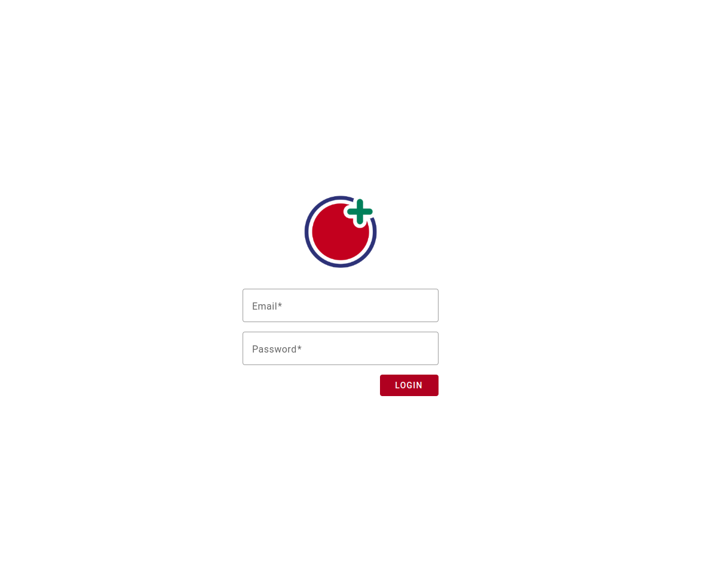
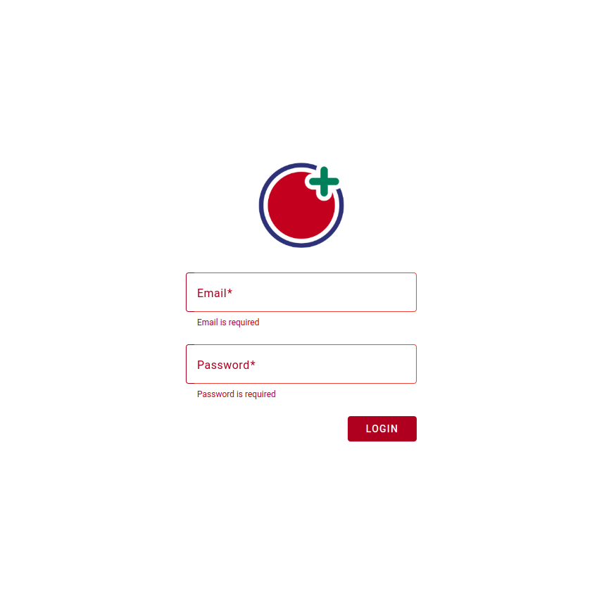
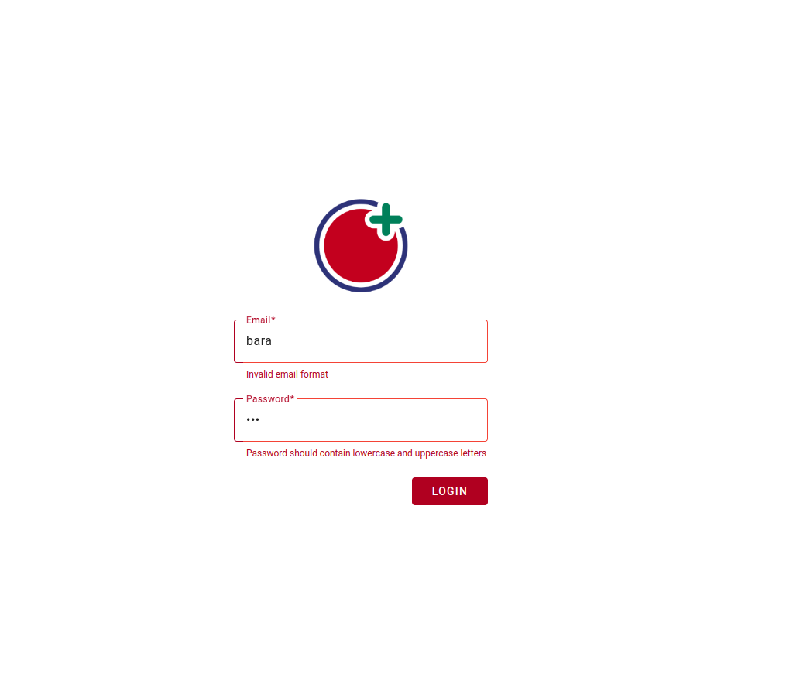

# Frontend task for Tamtem Company:-

The frontend task for Tamtem Company involves creating a login form in Angular using reactive forms. The login form have fields for the username and password. The form also be styled using SCSS and Angular Material.

Here's a steps-by-step that followed to achieve the task :-

1. Create new angular project inside the repo by using the following command :- 

`ng new client`

2. Create three components that will hold all code as the following structure :- 

```
.
├── app.component.html
├── app.component.scss
├── app.component.ts
├── app.module.ts
├── client-form
│   ├── client-form.component.html
│   ├── client-form.component.scss
│   └── client-form.component.ts
├── client-login
│   ├── client-login.component.html
│   ├── client-login.component.scss
│   └── client-login.component.ts
└── client-logo
    ├── client-logo.component.html
    ├── client-logo.component.scss
    └── client-logo.component.ts
```

3. Install angular material that used to style our form by using the following command :- 

`ng add @angular/material`

4. Import all modules that need in the app in app.module.ts as the following :-

```
 imports: [
    BrowserModule,
    ReactiveFormsModule,
    MatFormFieldModule,
    BrowserAnimationsModule,
    MatButtonModule,
    MatIconModule,
    MatInputModule
  ],
```

5. declare all components that used in the app inside app.module.ts (they will declared automatically if they cli used to generate components) as the following :- 

```
  declarations: [
    AppComponent,
    ClientLogoComponent,
    ClientFormComponent,
    ClientLoginComponent
  ],
```

6. So in the client form component formGroup is inject and declared, and used to create form as the following inaddition to use Validators to valid each field based on requirements :-    

```
  loginForm: FormGroup;

  constructor(private formBuilder: FormBuilder) {
    this.loginForm = this.formBuilder.group({
      email: ['', [Validators.required, Validators.email]],
      password: ['', Validators.required],
    });
  }
```

7. And in client form component template the form was used and by help of validation feature of Reactive form module error message handled , take a look to the following example of the filed and validation message :- 

```
    <!-- Email field -->
    <section>
        <mat-form-field appearance="outline">
            <mat-label>Email</mat-label >
            <input formControlName="email" matInput placeholder="Email">
        </mat-form-field>
    </section>
    <!-- Validation messages -->
    <div class="login__wrapper__form--validationMessage" *ngIf="loginForm.get('email')?.invalid && (loginForm.get('email')?.dirty || loginForm.get('email')?.touched)">
        <div *ngIf="loginForm.get('email')?.errors?.['required']">Email is required</div>
        <div *ngIf="loginForm.get('email')?.errors?.['email']">Invalid email format</div>
    </div>
```

8. Create onSubmit method to print the result .

9. Submit button will stay disabled if the input not validate 


## To run the code just follow the following instructions :-

1. Clone the repo `gh repo clone baraaAlosaily/Tamatem-Frontend-Task`
2. Move to client directory by using the following command `cd client`
3. Run the following command `ng serve`
4. Open the following URL `http://localhost:4200/`

Note: make sure that you install angular 15 or latest version of angular 


## Screenshots 

#### Full Screen



#### Mobile View 


#### Validation Messages



#### Validation Messages 


